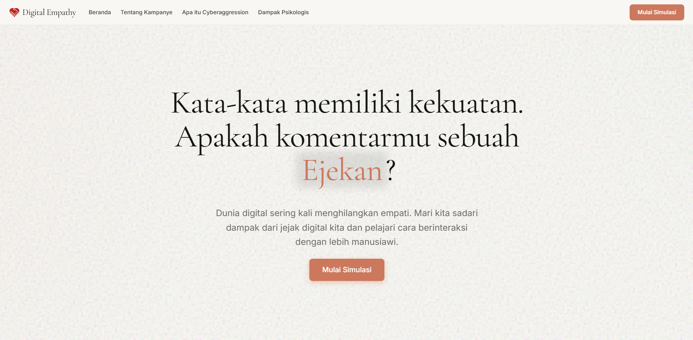
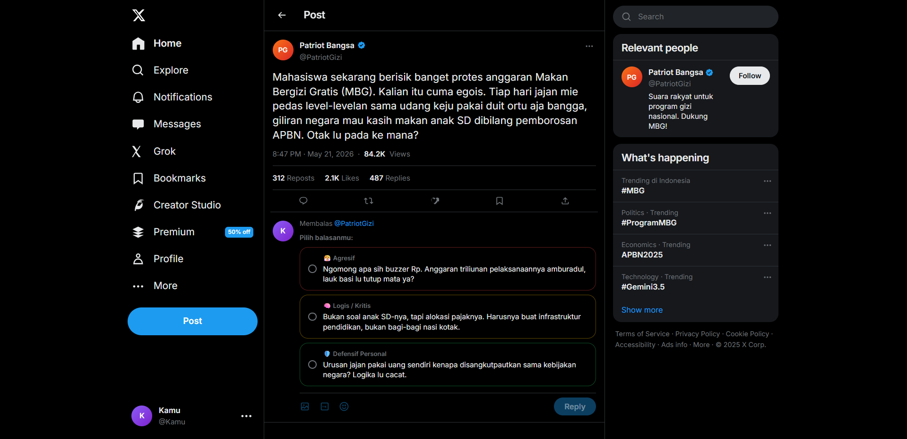
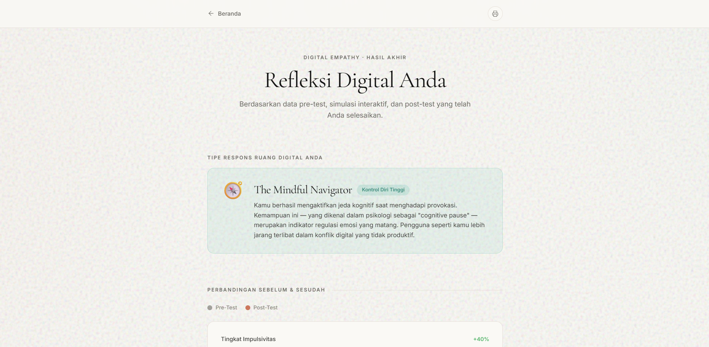

# Digital Empathy: Literasi Emosi di Dunia Digital

[](https://digital-empathy-cyber.web.app)

Proyek kampanye digital ini merupakan tugas mata kuliah Cyberpsychology oleh Kelompok 3 Universitas Bunda Mulia. Website ini bertujuan untuk meningkatkan kesadaran literasi emosi dalam berinteraksi di dunia digital melalui sebuah simulasi interaktif.

## 🔗 Live Demo
Anda dapat mengakses website yang telah berjalan (live) melalui tautan berikut: 
**[https://digital-empathy-cyber.web.app](https://digital-empathy-cyber.web.app)**

## 💻 Tech Stack

Website ini dibangun dan di-deploy dengan menggunakan teknologi modern:

- **Frontend Framework**: [React.js](https://react.dev/) + [Vite](https://vitejs.dev/) - Untuk performa *development* dan *build* yang sangat cepat.
- **Styling**: [Tailwind CSS](https://tailwindcss.com/) - Digunakan untuk mendesain antarmuka secara *Mobile-First* yang responsif, dinamis, dan profesional.
- **Backend & Database**: [Firebase Firestore](https://firebase.google.com/docs/firestore) - Untuk penyimpanan data (seperti hasil Pre-test dan Post-test) dengan latensi rendah.
- **Hosting**: [Firebase Hosting](https://firebase.google.com/docs/hosting) - Digunakan sebagai platform untuk mempublikasikan (deploy) *production build* dari website.

## 📸 Screenshots

### Halaman Utama (Home)


### Simulasi Interaktif (Sandbox)


### Ringkasan & Edukasi (Summary)


## 🚀 Instalasi & Menjalankan Proyek Secara Lokal

Jika Anda ingin mencoba atau menjalankan proyek ini di komputer Anda sendiri, ikuti instruksi berikut:

### Prasyarat
Pastikan komputer Anda sudah terinstal perangkat lunak berikut:
- [Node.js](https://nodejs.org/) (Versi 18 atau terbaru)
- [Git](https://git-scm.com/)

### Langkah-langkah

1. **Clone repositori ini**:
   ```bash
   git clone https://github.com/Kndy26/Digital-Empathy-Campaign-Website.git
   cd Digital-Empathy-Campaign-Website
   ```

2. **Install Dependensi**:
   Unduh semua *library* pendukung dengan menjalankan:
   ```bash
   npm install
   ```

3. **Konfigurasi Variabel Lingkungan (*Environment Variables*)**:
   - Jika Anda memiliki akses ke *database* Firebase Anda sendiri, buat file bernama `.env` di dalam *root* direktori proyek.
   - Masukkan *keys* konfigurasi Firebase ke dalam file `.env` tersebut.

4. **Jalankan *Development Server***:
   ```bash
   npm run dev
   ```
   - Aplikasi akan berjalan. Silakan buka browser Anda dan kunjungi URL lokal yang tertera di terminal (biasanya `http://localhost:5173`).

## 🛠 Proses Build & Deployment

Website ini menggunakan Firebase CLI untuk di-deploy secara langsung. Proses deployment terdiri dari:

1. **Membuat *Production Build***:
   ```bash
   npm run build
   ```
   *Perintah ini akan melakukan kompilasi, optimasi, dan *minification* kode JavaScript dan CSS ke dalam direktori `dist/`.*

2. **Deploy ke Firebase** (Bagi yang memiliki otoritas proyek Firebase):
   ```bash
   firebase deploy
   ```
   *Firebase CLI akan secara otomatis mengunggah folder `dist/` (Hosting) serta konfigurasi keamanan Firestore (`firestore.rules` & `firestore.indexes.json`).*

---
**Proyek Kampanye Digital - Cyberpsychology - Kelompok 3 - Universitas Bunda Mulia**